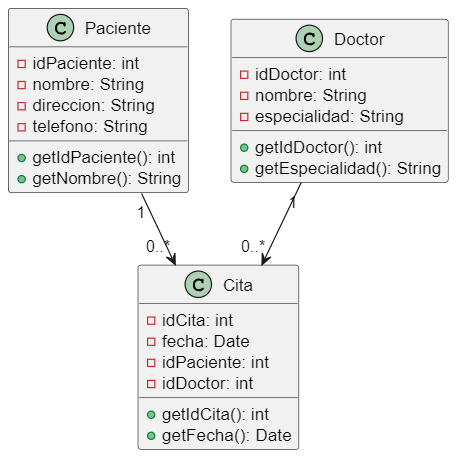

Codigo WSD
```js
@startuml hospital
class Paciente {
    - idPaciente: int
    - nombre: String
    - direccion: String
    - telefono: String
    + getIdPaciente(): int
    + getNombre(): String
}

class Doctor {
    - idDoctor: int
    - nombre: String
    - especialidad: String
    + getIdDoctor(): int
    + getEspecialidad(): String
}

class Cita {
    - idCita: int
    - fecha: Date
    - idPaciente: int
    - idDoctor: int
    + getIdCita(): int
    + getFecha(): Date
}

Paciente "1" --> "0..*" Cita
Doctor "1" --> "0..*" Cita
@enduml


```


Descripción del ejercicio:
Modela la asignación de citas entre pacientes y doctores, permitiendo gestionar la información de contacto y especialidad de cada doctor y los datos básicos de los pacientes.

Explicación y utilidad del diagrama
El diagrama muestra cómo se relacionan pacientes y doctores a través de las citas, proporcionando una estructura clara para manejar la agenda médica.

Propósito de cada clase:
Paciente: Almacena los datos de contacto de cada paciente.
Doctor: Representa a cada doctor en el hospital, incluyendo su especialidad.
Cita: Almacena la información de cada cita médica, vinculada tanto a un paciente como a un doctor.