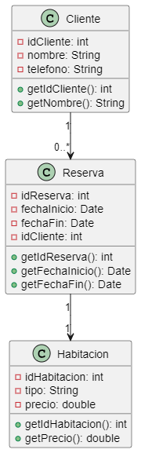

Codigo WSD

```js
@startuml hotel
class Cliente {
    - idCliente: int
    - nombre: String
    - telefono: String
    + getIdCliente(): int
    + getNombre(): String
}

class Reserva {
    - idReserva: int
    - fechaInicio: Date
    - fechaFin: Date
    - idCliente: int
    + getIdReserva(): int
    + getFechaInicio(): Date
    + getFechaFin(): Date
}

class Habitacion {
    - idHabitacion: int
    - tipo: String
    - precio: double
    + getIdHabitacion(): int
    + getPrecio(): double
}

Cliente "1" --> "0..*" Reserva
Reserva "1" --> "1" Habitacion
@enduml
```

Descripción del ejercicio:
Este sistema gestiona las reservas de habitaciones en un hotel, almacenando los datos de cada cliente, habitación y la reserva.

Explicación y utilidad del diagrama
Permite la organización de las reservas de clientes, vinculándolas a habitaciones específicas, y facilita la gestión de la disponibilidad de las mismas.

Propósito de cada clase:
Cliente: Representa a cada huésped, con sus datos personales.
Reserva: Contiene los detalles de cada reserva, incluyendo la fecha de inicio y fin.
Habitación: Almacena la información de cada habitación en el hotel, como su tipo y precio.