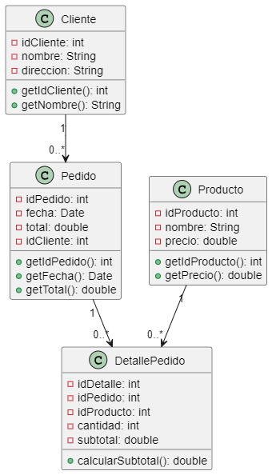

```js
@startuml gestion_pedidos
class Cliente {
    - idCliente: int
    - nombre: String
    - direccion: String
    + getIdCliente(): int
    + getNombre(): String
}

class Pedido {
    - idPedido: int
    - fecha: Date
    - total: double
    - idCliente: int
    + getIdPedido(): int
    + getFecha(): Date
    + getTotal(): double
}

class Producto {
    - idProducto: int
    - nombre: String
    - precio: double
    + getIdProducto(): int
    + getPrecio(): double
}

class DetallePedido {
    - idDetalle: int
    - idPedido: int
    - idProducto: int
    - cantidad: int
    - subtotal: double
    + calcularSubtotal(): double
}

Cliente "1" --> "0..*" Pedido
Pedido "1" --> "0..*" DetallePedido
Producto "1" --> "0..*" DetallePedido
@enduml
```

Descripción del ejercicio:
Este sistema modela un flujo básico de gestión de pedidos de un cliente, con productos y detalles individuales para cada pedido.

Explicación y utilidad del diagrama
El diagrama ilustra la estructura del pedido y permite gestionar la información de productos comprados, cliente y total del pedido.

Propósito de cada clase:
Cliente: Representa al cliente que realiza pedidos, almacenando sus datos.
Pedido: Almacena los datos de cada pedido realizado, incluyendo la fecha y el total.
Producto: Representa cada artículo disponible para compra, con nombre y precio.
DetallePedido: Almacena los productos incluidos en cada pedido, con cantidad y subtotal.