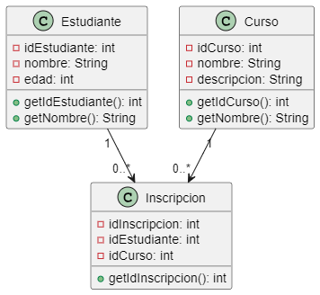

```js
@startuml escuela
class Estudiante {
    - idEstudiante: int
    - nombre: String
    - edad: int
    + getIdEstudiante(): int
    + getNombre(): String
}

class Curso {
    - idCurso: int
    - nombre: String
    - descripcion: String
    + getIdCurso(): int
    + getNombre(): String
}

class Inscripcion {
    - idInscripcion: int
    - idEstudiante: int
    - idCurso: int
    + getIdInscripcion(): int
}

Estudiante "1" --> "0..*" Inscripcion
Curso "1" --> "0..*" Inscripcion
@enduml

```

Descripción del ejercicio:
Este modelo representa el proceso de inscripción de estudiantes en cursos en una escuela.

Explicación y utilidad del diagrama
Permite ver la relación entre estudiantes y cursos, y cómo cada inscripción asocia un estudiante a un curso específico.

Propósito de cada clase:
Estudiante: Almacena los datos de cada estudiante inscrito.
Curso: Contiene la información de cada curso, como nombre y descripción.
Inscripción: Representa la relación entre estudiantes y cursos.