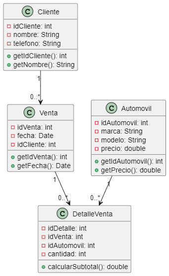

Codigo WSD
```JS
@startuml ventas_automoviles
class Cliente {
    - idCliente: int
    - nombre: String
    - telefono: String
    + getIdCliente(): int
    + getNombre(): String
}

class Automovil {
    - idAutomovil: int
    - marca: String
    - modelo: String
    - precio: double
    + getIdAutomovil(): int
    + getPrecio(): double
}

class Venta {
    - idVenta: int
    - fecha: Date
    - idCliente: int
    + getIdVenta(): int
    + getFecha(): Date
}

class DetalleVenta {
    - idDetalle: int
    - idVenta: int
    - idAutomovil: int
    - cantidad: int
    + calcularSubtotal(): double
}

Cliente "1" --> "0..*" Venta
Venta "1" --> "0..*" DetalleVenta
Automovil "1" --> "0..*" DetalleVenta
@enduml


```

Descripción del ejercicio
Este sistema permite gestionar las ventas de automóviles, incluyendo el registro de clientes y vehículos vendidos.

Explicación y utilidad del diagrama
Facilita la gestión de inventario de automóviles y las ventas asociadas a cada cliente, organizando la información de cada transacción.

Propósito de cada clase:
Cliente: Almacena la información del cliente.
Automóvil: Representa cada automóvil disponible para venta, con detalles de marca, modelo y precio.
Venta: Registra cada venta realizada a un cliente, almacenando la fecha y el total.
DetalleVenta: Describe cada automóvil vendido en una venta específica.
